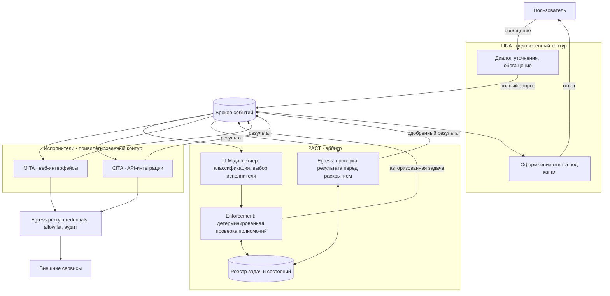

# Логическая декомпозиция: четыре контура

Статус: Draft 0.1  
Дата: 2026-08-08  
Язык документа: русский  
Связанные документы: [базовая спецификация](./SPECIFICATION.md), [вариант реализации на OpenClaw](./IMPLEMENTATION-OPTION-OPENCLAW.md)

## 1. Назначение документа

Документ фиксирует разбиение Second System на четыре контура, границы между ними и механизм принуждения этих границ.

Документ не описывает внутреннее устройство контуров. Каждый контур прорабатывается отдельно после фиксации границы. Здесь определяется только то, что нельзя решать внутри одного контура, не затрагивая остальные.

Спецификация описывает систему в терминах пятнадцати компонентов. Этот документ группирует их в четыре контура и является более высоким уровнем описания той же системы.

## 2. Четыре контура

| Контур | Расшифровка | Отвечает за | Не отвечает за |
|---|---|---|---|
| **LINA** | Linguistic Interface Agent | Диалог с человеком, сбор и обогащение запроса до полноты, возврат одобренного результата в чат | Состояние задачи, полномочия, исполнение |
| **PACT** | Policy, Authorization & Control Tier | Маршрутизацию, авторизацию, реестр и состояния задач, проверку исходящего результата | Разговор с пользователем, выполнение действий |
| **MITA** | Manual Interaction Task Agent | Выполнение задач через веб-интерфейсы там, где API отсутствует | Выбор того, что и когда выполнять |
| **CITA** | Contract Integration Task Agent | Выполнение задач через подготовленные API-интеграции | Выбор того, что и когда выполнять |

### 2.1. Имена как часть архитектуры

Форма имён несёт смысл и выбрана намеренно.

**Три агента и один не-агент.** LINA, MITA и CITA — агентные структуры, и их имена однотипны. PACT назван иначе по форме, а не только по раскрытию: это не имя-агент. Асимметрия видна до чтения раскрытия и работает на инвариант 3 сильнее любой формулировки в тексте.

**Общий суффикс `-TA` обозначает уровень исполнителя.** MITA и CITA — родственники: один уровень, разные способы взаимодействия с внешним миром. Первые буквы несут модальность, `-TA` несёт принадлежность к исполнителям.

**Плата за родственность.** MITA и CITA различаются одним символом. Это осознанный компромисс: сходство передаёт смысл, но создаёт риск опечатки там, где эти идентификаторы используются чаще всего — в таблицах правил PACT. Опечатка переносит разрешение с исполнителя, работающего по контракту, на исполнителя, управляющего чужим веб-интерфейсом, то есть в сторону большего риска.

Компенсация обязательна и тривиальна: **идентификатор исполнителя в правилах и событиях проверяется по закрытому перечню.** Неизвестное или неожиданное значение приводит к отказу, а не к выбору по умолчанию. Тогда опечатка становится громкой ошибкой вместо тихой выдачи лишнего права.

## 3. Обоснование разреза

### 3.1. Одна ось изменений на контур

Разрез считается верным, если у каждого контура своя причина меняться и эти причины не пересекаются.

| Контур | Меняется, когда | Не меняется, когда |
|---|---|---|
| LINA | меняется API мессенджера, стиль диалога, стратегия уточнений | появилась интеграция, изменились политики |
| PACT | меняются правила, типы capabilities, состояния задач | переверстали внешний сайт, сменился Bot API |
| MITA | целевой веб-интерфейс переделали, добавили новый сайт | у вендора появилось API |
| CITA | новая интеграция, изменилась версия внешнего API | изменилась логика диалога |

Четыре независимые оси. Условие выполняется.

### 3.2. Два контура доверия

Функциональных контуров четыре, контуров доверия — два, и граница между ними проходит по PACT.

```text
недоверенный          арбитр            привилегированные
    LINA        →      PACT        →      MITA / CITA
    LINA        ←      PACT        ←      MITA / CITA
```

- LINA обрабатывает внешний недоверенный ввод и не имеет полномочий.
- MITA и CITA обладают доступом к внешним системам и не принимают решений.
- PACT стоит между ними и является единственным арбитром.

### 3.3. Двусторонняя точка сужения

Ключевое свойство схемы: не существует пути от внешнего сообщения к привилегированному исполнителю и обратно, минующего PACT.

Прямой путь проверяет допустимость исполнения. Обратный путь проверяет допустимость раскрытия результата. Второе не менее важно первого: результат исполнения содержит фрагменты страниц, ответы API, тексты ошибок и содержимое файлов, то есть данные, часть которых не предназначена внешнему каналу.

## 4. Поток обработки



## 5. LINA

### 5.1. Роль

LINA симметрична. На входе она превращает разговор в полный запрос, на выходе — одобренный результат обратно в разговор.

Семантики задачи у LINA нет. Реплика «это не то» для неё не является провалом задачи: это новый раунд сбора полноты.

### 5.2. Критерий полноты

Полнота — собственный критерий LINA и её единственное решение о переходе к следующему контуру. Формулировка: запрос полон, когда LINA располагает всем, что ей необходимо для его передачи.

Недостающее LINA уточняет двумя способами: вопросами пользователю через тот же канал и обращением к подчинённым агентам своего контура.

### 5.3. Границы

- LINA не определяет полномочия и не влияет на них.
- LINA не хранит состояние задачи.
- LINA не получает результат исполнения напрямую от MITA или CITA — только после проверки PACT.
- Текст пользователя не может изменить маршрут доставки ответа.

### 5.4. Незакрытое — закрыто 2026-08-11 (D-021)

Цикл уточнений не ограничен по числу раундов, и это **принято намеренно**: диалог является предметом контура, а человек в цикле сам служит ограничителем. Предохранителем служит бюджет обращений к модели на один ход (между двумя сообщениями человека), стоимость считается в токенах, а мягкий порог цепочки приводит к свёртке контекста, а не к остановке беседы. Потолка времени нет: цепочки хранятся и возобновляются. Выход «обратиться к владельцу напрямую» сохраняется как фоновое уведомление, публикуемое через egress-часть PACT. Подробности — D-021.

## 6. PACT

### 6.1. Разделение внутри контура

PACT состоит из двух частей с разными свойствами, и их смешение отменяет смысл контура.

| Часть | Реализация | Решает |
|---|---|---|
| Диспетчер | LLM-агенты | классификацию задачи, предложение capabilities, выбор исполнителя, формулировку отказа для человека, черновик нового правила |
| Enforcement | детерминированный код и таблицы правил | выдачу полномочий, требование approval, допустимость раскрытия результата |

### 6.2. Основное правило контура

> **LLM выбирает маршрут. LLM не выбирает полномочия.**

Маршрут — предложение, которое затем проверяется. Авторизация — сама проверка. Если проверку выполняет модель, проверять больше нечем.

Три следствия, по которым enforcement обязан быть детерминированным:

1. **Промптуемость.** Текст задачи неизбежно попадает в контекст оценивающего агента. Нельзя одновременно дать модели текст на оценку и защитить её от этого текста. Детерминированный гейт видит `requested_capabilities` как набор строк и сверяет с таблицей, не читая обоснований.
2. **Недетерминированность.** Одинаковая задача не должна получать разные вердикты в разные дни.
3. **Непроверяемость.** Требуется регрессия вида «capability X никогда не выдаётся без approval», просмотр изменений правил диффом и объяснение постфактум, почему доступ был выдан.

### 6.3. Состояние

PACT — оркестратор с базой данных и владелец жизненного цикла задачи: реестр задач, состояния, лизинги исполнителей, решения approval, журнал вердиктов.

LINA владеет состоянием диалога. Связь между диалогом и задачей передаётся непрозрачными идентификаторами в событиях. Ни один контур не пишет в хранилище другого.

### 6.4. Egress

Проверка результата перед раскрытием — обязанность enforcement-части, а не диспетчера. Минимальный состав проверки: отсутствие секретов и учётных данных, отсутствие внутренних логов и трассировок, соответствие маршрута исходной задаче, допустимость автоматического раскрытия без ручного review.

## 7. MITA и CITA

### 7.1. Разрез по модальности исполнения

Граница проходит по наличию пригодного API у целевой системы, а не по предметной области.

| | MITA | CITA |
|---|---|---|
| Способ | веб-интерфейс, браузер | подготовленная API-интеграция |
| Стоимость | сценарий под каждую цель | интеграция один раз, переиспользуется |
| Хрупкость | ломается при редизайне | ломается при смене версии API |
| Ошибки | неструктурированные | коды и схемы |
| Идемпотентность | как правило отсутствует | как правило достижима |

### 7.2. Асимметрия риска

Контуры соседние по положению и несопоставимые по риску. MITA читает недоверенные веб-страницы и действует по прочитанному, работает в живых сессиях внешних систем, а его действия часто необратимы. При модели доставки at-least-once повторная отправка формы — это второе выполнение действия, а не повторное чтение.

Отсюда правило: **в MITA необратимые действия по умолчанию требуют approval, обратимые — нет.** Отнесение действия к необратимым определяется таблицей PACT по хосту и типу операции, а не решением агента. Это то же правило 6.2, применённое на уровне отдельного запроса.

### 7.3. Capability не знает о модальности

Граница MITA/CITA подвижна: при появлении API у внешнего сервиса та же возможность переезжает из одного контура в другой. Поэтому:

- задача не адресуется исполнителю заказчиком, исполнителя выбирает диспетчер PACT;
- capability именуется `invoice.submit`, а не `invoice.submit.via-web`.

Иначе появление API потребует переписывания политик вместо изменения маршрута.

## 8. Механизм принуждения границы

### 8.1. Постановка

PACT является гейтом только в том случае, если MITA и CITA не способны действовать без его решения. При постоянных учётных данных у исполнителей PACT защищает лишь корректный путь: дефект или инъекция внутри исполнителя обходят его целиком.

Внешние сервисы в большинстве своём не выдают короткоживущие учётные данные под задачу. Веб-интерфейс, ради которого существует MITA, не выдаёт ничего, кроме долгоживущей сессии. Следовательно, свойство обеспечивается механизмами, находящимися под контролем системы.

### 8.2. Основной механизм: отсутствие прямого сетевого доступа

MITA и CITA не имеют исходящего сетевого доступа. Весь внешний трафик проходит через egress proxy, который хранит учётные данные и подставляет их сам.

На каждый запрос proxy проверяет наличие действующей авторизации PACT для этой задачи, допустимость домена и допустимость метода.

Получаемые свойства:

- учётные данные не находятся в памяти исполнителя, поэтому не могут быть из него извлечены;
- контроль применяется к каждому запросу, а не к сессии: по истечении лизинга следующий запрос отклоняется в середине выполнения;
- allowlist доменов исполняется на транспортном уровне, поэтому указание обратиться к постороннему хосту не проходит;
- журнал всех внешних вызовов ведётся в одном месте.

Для CITA proxy подставляет заголовок авторизации разрешённым хостам. Для MITA браузер запускается через proxy, работающий как MITM с собственным CA, и подставляет `Cookie` в запросы к разрешённым доменам; браузер сессию не видит.

### 8.3. Порядок внедрения

| Шаг | Содержание | Что закрывает |
|---|---|---|
| 0 | нет прямого egress у исполнителей, proxy с allowlist доменов, учётные данные пока на месте | эксфильтрацию данных |
| 1 | учётные данные переносятся в proxy | извлечение секрета из исполнителя |
| 2 | proxy проверяет подпись PACT на каждом запросе | действие без авторизации |
| 3 | эфемерное окружение на задачу, отзыв лизинга по завершении | переиспользование доступа между задачами |

Шаги полезны по отдельности и внедряются последовательно. Шаг 0 наиболее дёшев и снимает наиболее вероятное.

> **Область применения (уточнение 2026-08-11, D-013).** Приведённый порядок обоснован постепенным
> укреплением **уже работающей** системы: он расставляет меры по убыванию отношения «снятый риск /
> стоимость». Планом сборки системы с нуля он не является — укреплять там нечего. При сборке шаги 0, 1
> и 2 выполняются одновременно и на первой волне: прокси, custody и проверка авторизации на каждом
> запросе строятся один раз. Отдельным шагом остаётся только 3 (эфемерное окружение), поскольку он
> добавляет жизненный цикл к уже существующим компонентам, а не заменяет их. См. `ROADMAP.md` §0.4.

### 8.4. Границы механизма

Механизм не закрывает два класса ситуаций.

**Легитимное действие, выполненное не по назначению.** Если разрешена операция создания записи, а исполнитель создал не ту запись, proxy пропустит запрос: домен, метод и авторизация корректны. Снижается сужением capability до конкретной операции и approval на необратимое.

**Системы, работающие только с человеческой сессией** — многофакторная аутентификация, капча, привязка к устройству. Техническая изоляция достигает потолка; остаётся подтверждение каждого необратимого действия.

## 9. Владение состоянием

| Данные | Владелец |
|---|---|
| Диалоги, история сообщений, состояние уточнений | LINA |
| Маршруты ответа и сопоставление внешних идентификаторов | LINA |
| Задачи, их состояния, лизинги | PACT |
| Решения политики и approval, журнал вердиктов | PACT |
| Таблицы правил, capabilities, классификация необратимых операций | PACT |
| Сценарии веб-исполнения | MITA |
| Описания интеграций | CITA |
| Учётные данные внешних систем | Egress proxy и хранилище секретов |
| Артефакты и результаты большого размера | Object Storage, ссылками в событиях |

Ни один контур не изменяет хранилище другого. Связи между контурами передаются непрозрачными идентификаторами в событиях.

## 10. Зафиксированные инварианты

1. Контуров четыре, контуров доверия два, граница проходит по PACT.
2. Не существует пути от внешнего сообщения к исполнителю и обратно, минующего PACT.
3. Enforcement-часть PACT не использует LLM.
4. LLM выбирает маршрут, но не полномочия.
5. LINA не владеет состоянием задачи и не влияет на полномочия.
6. Результат исполнения попадает в LINA только после egress-проверки PACT.
7. Исполнитель не имеет прямого исходящего сетевого доступа.
8. Учётные данные внешних систем не находятся в исполнителях.
9. Исполнителя выбирает PACT; capability не содержит указания на модальность.
10. В MITA необратимые действия требуют approval по умолчанию.
11. Идентификатор исполнителя в правилах и событиях проверяется по закрытому перечню; неизвестное значение приводит к отказу.

Изменение любого пункта требует отдельного архитектурного решения.

## 11. Что это меняет в SPECIFICATION.md

Правки внесены 2026-08-09.

| Раздел | Изменение | Статус |
|---|---|---|
| §5.3 | правило «LLM выбирает маршрут, но не полномочия»; запрет на LLM в компоненте, выдающем полномочия | внесено |
| §5.7 | новый раздел: внешний ответ публикует единственный доверенный компонент | внесено |
| §7.10 | `Policy Gate` детерминирован, предложения моделей — входные данные | внесено |
| §7.14 | Worker разделён по модальности; публикует предложение ответа, а не событие доставки | внесено |
| §7.15 | Tool Gateway уточнён до egress proxy | внесено |
| §7.16 | новый компонент `Egress Guard` | внесено |
| §8 | добавлен топик `reply.proposed.v1` | внесено |
| §12.1–12.3 | сценарии проведены через `Egress Guard` | внесено |
| §14 | проверка результата перед раскрытием | внесено |
| §17 | право публикации `outbound.*` отобрано у Worker и Qualifier | внесено |
| §23 | добавлены инварианты 11–16 | внесено |
| §10.2 | получатель должен выводиться доверенным компонентом, поле квалификатора — подсказка | **внесено 2026-08-11** решением D-020 |

## 12. Соответствие этапу 0

> **Раздел не действует с 2026-08-11.** Решение D-011, которое он отображает, отклонено в пользу D-013
> («волна ограничивает объём, а не устройство»). Таблица ниже сохраняется как история. Действующее
> соответствие «контур → минимальный объём первой волны» — `ROADMAP.md`, раздел 3 (`W1`): все четыре
> контура присутствуют в целевом устройстве, границы существуют **и в коде, и в развёртывании**,
> а минимальность выражается объёмом — один канал, один владелец, один исполнитель, одна интеграция,
> только обратимые операции.

На минимальном контуре все четыре контура находятся внутри одного процесса и выражены конфигурацией:

| Контур | Этап 0 |
|---|---|
| LINA | канальный слой: Telegram и WebChat |
| PACT | allowlist отправителей, sandbox-профиль, права инструментов |
| MITA | отсутствует |
| CITA | встроенные инструменты runtime |

Границы существуют в коде и конфигурации, но не в развёртывании. Основанием для разделения на отдельные процессы служит момент, когда исполнителю потребуется доступ к системе, потерю которой владелец заметит.

## 13. Открытые вопросы

Не решается в этом документе и подлежит решению при проработке контуров:

- потолок раундов и стоимости цикла уточнений LINA;
- число обращений к модели на одну задачу и его допустимая граница;
- выбор брокера и формата схем событий;
- где проходит граница между подчинёнными агентами LINA и диспетчером PACT при классификации;
- формат подписи авторизации PACT, проверяемой egress proxy;
- перечень исходных интеграций CITA и целевых систем MITA;
- начальный набор capabilities и профилей approval.
