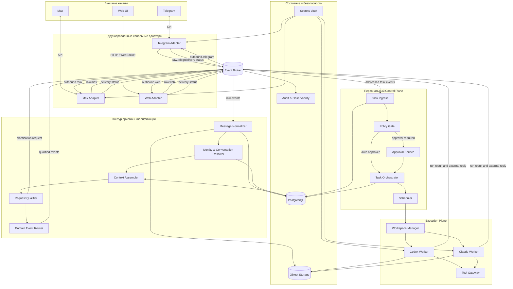
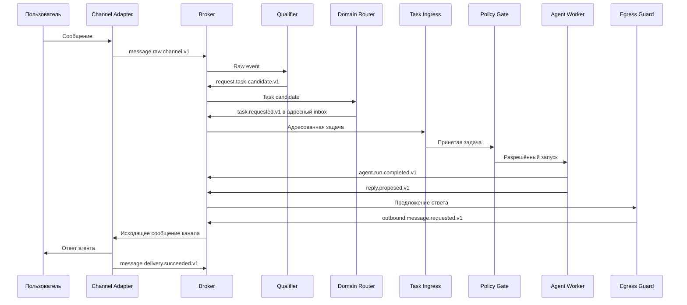

# Second System: событийная система управления персональными AI-агентами

Статус: Draft 0.1  
Дата: 2026-08-06  
Язык документа: русский

## Связанные документы

- [CONTOURS.md](./CONTOURS.md) — логическая декомпозиция на четыре контура: **LINA** (диалог), **PACT** (арбитр), **MITA** (исполнение через веб-интерфейсы), **CITA** (исполнение через API). Содержит инварианты, уточняющие настоящую спецификацию.
- [DECISIONS.md](./DECISIONS.md) — журнал архитектурных решений с обоснованиями.
- [REVIEW-FINDINGS.md](./REVIEW-FINDINGS.md) — замечания к настоящему документу и их статус. **Содержит открытые пункты, требующие решения до реализации.**
- [STAGE-0.md](./STAGE-0.md) — минимальный контур и принимаемые на нём риски.
- [IMPLEMENTATION-OPTION-OPENCLAW.md](./IMPLEMENTATION-OPTION-OPENCLAW.md) — вариант реализации на готовом шлюзе.

## 1. Назначение

Second System принимает сообщения из внешних каналов, квалифицирует их, создаёт адресованные задачи для персонального контура исполнения, запускает Codex или Claude Code и возвращает результат в исходный канал через брокер событий.

Система проектируется как набор слабо связанных сервисов, взаимодействующих через версионированные события. Брокер является центральной интеграционной шиной и используется в обоих направлениях:

- от внешнего канала к квалификатору и агенту;
- от квалификатора или агента обратно к внешнему каналу.

## 2. Цели

Система должна:

1. Принимать сообщения из Telegram, Max и веб-интерфейса.
2. Сохранять исходное сообщение и его канал доставки без потери корреляции.
3. Квалифицировать обращение и определить необходимый следующий шаг.
4. Задавать уточняющие вопросы через исходный канал.
5. Передавать в персональный `Task Ingress` только поддерживаемые типы событий, адресованные конкретному пользователю и его системе.
6. Пропускать принятую задачу через `Policy Gate` до исполнения.
7. Выполнять разрешённые задачи с помощью Codex или Claude Code.
8. Записывать внутренний результат выполнения и предназначенный пользователю ответ в брокер.
9. Доставлять ответ тем же канальным адаптером, который обслуживает соответствующий внешний канал.
10. Обеспечивать трассируемость, повторную обработку, дедупликацию и аудит.

## 3. Не входит в текущий объём

На этой стадии не определяются:

- конкретный продукт для брокера событий;
- конкретная LLM и промпт квалификатора;
- пользовательский дизайн веб-интерфейса;
- бизнес-правила квалификации по отдельным проектам;
- точные инструкции, доступные исполнительным агентам;
- схема биллинга или многопользовательская коммерческая модель.

## 4. Термины

| Термин | Значение |
|---|---|
| Канальный адаптер | Двунаправленный сервис интеграции с Telegram, Max или веб-интерфейсом |
| Сырое сообщение | Сообщение, полученное из внешнего канала и ещё не прошедшее квалификацию |
| Квалификатор | Сервис, определяющий семантический тип обращения и следующий шаг |
| Task Ingress | Единственная точка приёма новых задач в персональный контур |
| Policy Gate | Компонент, определяющий допустимость и границы исполнения задачи |
| Worker | Обёртка над Codex CLI или Claude Code CLI |
| Reply route | Неизменяемая ссылка на канал и конечную точку, куда должен быть возвращён ответ |
| Domain event | Типизированное событие предметной области после нормализации или квалификации |
| Outbound event | Событие, явно разрешённое к доставке во внешний канал |

## 5. Архитектурные решения

### 5.1. Брокер является центральной шиной

Сервисы не вызывают друг друга синхронно в основном рабочем потоке. Они публикуют события и подписываются на необходимые им типы. Синхронные API допускаются для административных операций, получения конфигурации и чтения справочников.

### 5.2. Канальные адаптеры двунаправленные

Для каждого внешнего канала существует логически единый адаптер, который:

- принимает входящие сообщения;
- публикует сырые события;
- читает адресованные его каналу исходящие события;
- отправляет сообщения через API канала;
- публикует результат доставки.

Отдельный общий `Outbound Router` не предусматривается.

### 5.3. Квалификация не является авторизацией

Квалификатор отвечает на вопрос «что это за обращение и что с ним следует сделать». `Policy Gate` отвечает на вопрос «может ли персональный агент выполнить эту задачу и с какими полномочиями».

Поле уверенности квалификатора не может предоставлять права на инструменты или отменять подтверждение пользователя.

Правило формулируется шире: **LLM выбирает маршрут, но не выбирает полномочия.** Модель может предложить классификацию обращения, набор capabilities, исполнителя и формулировку отказа. Всё это является входом для проверки, а не решением.

Компонент, выдающий полномочия, детерминирован и не использует LLM. Основания: оценивающему агенту неизбежно передаётся текст обращения, поэтому защитить его от инструкций внутри этого текста невозможно; вердикт должен быть воспроизводимым; требуется регрессионная проверка вида «capability X не выдаётся без approval» и возможность объяснить основание выдачи прав постфактум.

### 5.4. Task Ingress не читает сырые события

`Task Ingress` подписан только на выделенный адресный поток своей системы. Он не должен получать сообщения других пользователей, неподдерживаемые типы событий или общий поток результатов квалификации.

### 5.5. Внутренний результат отделён от внешнего ответа

Агент публикует внутреннее событие выполнения отдельно от сообщения, разрешённого к отправке пользователю. Канальные адаптеры никогда не отправляют в чат произвольные логи, stdout, трассировки, содержимое рабочих каталогов или внутренние результаты инструментов.

### 5.6. Подписочные учётные данные изолированы

Учётные данные Codex и Claude Code находятся только в соответствующих Workers или доверенном хранилище секретов. Они не передаются адаптерам, квалификатору, брокеру, веб-интерфейсу или другим пользователям.

Персональный execution-контур предназначен для задач владельца системы. Контур внешнего общения и квалификации должен использовать отдельные разрешённые способы доступа к моделям и не превращать персональную CLI-подписку в общий публичный API.

### 5.7. Внешний ответ публикуется единственным доверенным компонентом

Ни агент, ни квалификатор не публикуют сообщения во внешние каналы напрямую и не объявляют свой вывод разрешённым к отправке.

Компоненты, формирующие содержимое, публикуют предложение ответа. Единственным продюсером событий внешней доставки является `Egress Guard` (§7.16), который применяет политику раскрытия и проверку на секреты.

Основание: агент исполняет вывод модели, работавшей с недоверенным контекстом. Право самостоятельно признать сообщение допустимым к отправке — граница, которой нельзя доверять компоненту, находящемуся под влиянием недоверенного ввода.

## 6. Общая архитектура



## 7. Компоненты

### 7.1. Telegram Adapter

Обязанности:

- принимать и проверять Telegram webhook/update;
- устранять дубликаты по идентификатору update/message;
- создавать или разрешать `reply_route`;
- сохранять большие вложения в Object Storage;
- публиковать `message.raw.telegram.v1`;
- читать `outbound.telegram.v1`;
- отправлять сообщение в Telegram;
- публиковать `message.delivery.succeeded.v1` или `message.delivery.failed.v1`.

### 7.2. Max Adapter

Имеет тот же контракт, что Telegram Adapter, но реализует API и особенности Max. Публикует `message.raw.max.v1` и читает `outbound.max.v1`.

### 7.3. Web Adapter

Обязанности:

- аутентифицировать пользователя веб-интерфейса;
- принимать сообщения и вложения;
- публиковать `message.raw.web.v1`;
- читать `outbound.web.v1`;
- доставлять ответы через WebSocket, SSE или механизм периодического опроса;
- публиковать состояние доставки, когда оно определимо.

### 7.4. Message Normalizer

Преобразует платформенные события в единый канонический формат. Не выполняет семантическую квалификацию и не изменяет смысл пользовательского текста.

### 7.5. Identity & Conversation Resolver

Детерминированно сопоставляет внешние идентификаторы с внутренними:

- пользователем;
- командой или проектом;
- системой-получателем;
- диалогом;
- конечной точкой для ответа.

Получатель не должен определяться AI исключительно по содержимому текста. Сопоставления хранятся в доверенном справочнике маршрутизации.

### 7.6. Context Assembler

Собирает ограниченный контекст обращения:

- предшествующие сообщения диалога;
- ответы на уточнения;
- ссылки на вложения;
- допустимую метаинформацию отправителя и проекта;
- связь с ранее созданной задачей.

Размер и глубина контекста ограничиваются конфигурацией.

### 7.7. Request Qualifier

Определяет тип обращения и формирует одно из доменных событий:

- кандидат в задачу;
- требование уточнения;
- информационное сообщение;
- требование эскалации;
- отклонённое или неподдерживаемое обращение;
- отмена или обновление существующего обращения.

Квалификатор может предложить необходимые возможности, но не назначает фактически разрешённые инструменты.

### 7.8. Domain Event Router

Проверяет тип, адресацию и системного получателя события. Кандидат в задачу публикуется в выделенный inbox только если:

- тип поддерживается `Task Ingress`;
- указан известный `recipient.user_id`;
- указан ожидаемый `recipient.system_id`;
- существует валидный `reply_route_id`;
- схема и версия события поддерживаются.

### 7.9. Task Ingress

Обязанности:

- читать только inbox своей системы;
- валидировать схему и адресата;
- обеспечивать идемпотентность создания задачи;
- записывать задачу в Task Registry;
- публиковать `task.accepted.v1` или `task.rejected.v1`;
- передавать принятую задачу в `Policy Gate`.

### 7.10. Policy Gate

Определяет:

- допустимо ли исполнение;
- нужен ли ручной approval;
- какой Worker можно использовать;
- какие capabilities разрешены;
- какие каталоги доступны;
- разрешены ли сетевые и внешние операции;
- может ли результат быть возвращён во внешний канал автоматически.

`Policy Gate` детерминирован и не использует LLM (§5.3). Предложения квалификатора и агентов являются для него входными данными.

### 7.11. Approval Service

Создаёт запрос подтверждения и хранит решение владельца системы. Решение связывается с конкретной версией задачи и набора capabilities.

### 7.12. Task Orchestrator и Scheduler

`Task Orchestrator` ведёт состояние задачи и запуска. `Scheduler` выдаёт lease подходящему Worker, контролирует конкурентность и повторные попытки.

### 7.13. Workspace Manager

Создаёт изолированный рабочий каталог, применяет инфраструктурную конфигурацию, монтирует разрешённые ресурсы и очищает или архивирует workspace после завершения.

### 7.14. Codex Worker и Claude Worker

Worker является доверенной обёрткой над соответствующим CLI. Он:

- получает разрешённое задание;
- подготавливает CLI-вызов;
- передаёт только разрешённый контекст;
- собирает stdout, файлы и статус выполнения;
- публикует прогресс и внутренний результат;
- отдельно формирует и публикует предназначенный внешнему пользователю ответ.

Сам CLI не получает прямые credentials брокера. Публикацию выполняет Worker Wrapper.

Workers разделяются по модальности исполнения (`CONTOURS.md` §7):

- исполнение через веб-интерфейсы там, где пригодное API отсутствует;
- исполнение через подготовленные интеграции с опубликованным контрактом.

Разделение существенно, поскольку риск и режим эксплуатации у них различаются: первый читает недоверенные страницы, работает в живых сессиях внешних систем и совершает преимущественно неидемпотентные действия. В нём необратимые операции требуют approval по умолчанию, а отнесение операции к необратимым определяется таблицей `Policy Gate`, а не решением агента.

Worker публикует внутренний результат и **предложение** внешнего ответа. Публикацию события внешней доставки выполняет `Egress Guard` (§7.16).

### 7.15. Tool Gateway

Посредничает при внешних побочных эффектах: тасксборды, репозитории, внутренние API и другие системы. Проверяет capability, область доступа и аудит каждой операции.

Реализуется как egress proxy, через который проходит весь исходящий трафик Workers. Workers не имеют прямого сетевого доступа, учётные данные внешних систем хранятся в proxy и подставляются им. На каждый запрос проверяется наличие действующей авторизации, допустимость домена и допустимость метода. Обоснование и порядок внедрения — `CONTOURS.md` §8.

### 7.16. Egress Guard

Единственный компонент, публикующий события внешней доставки.

Обязанности:

- принимать предложения ответа от Workers и квалификатора;
- применять политику раскрытия: допустимо ли автоматическое возвращение результата;
- проверять содержимое на секреты, учётные данные, внутренние логи и трассировки;
- проверять соответствие маршрута исходной задаче;
- публиковать `outbound.message.requested.v1` в топик соответствующего канала;
- направлять на ручной review то, что политика не разрешает публиковать автоматически.

Компонент детерминирован по тем же основаниям, что и `Policy Gate`.

## 8. Топология брокера

Конкретный синтаксис зависит от выбранного брокера. Логическая топология:

```text
inbound.raw.telegram.v1
inbound.raw.max.v1
inbound.raw.web.v1

inbound.normalized.v1

requests.task-candidate.v1
requests.clarification-needed.v1
requests.information-only.v1
requests.escalation-needed.v1
requests.rejected.v1
requests.cancelled.v1

tasks.inbox.personal-agent-system.v1
tasks.accepted.v1
tasks.rejected.v1

policy.decided.v1
approvals.requested.v1
approvals.decided.v1

runs.requested.codex.v1
runs.requested.claude.v1
runs.started.v1
runs.progress.v1
runs.completed.v1
runs.failed.v1

reply.proposed.v1

outbound.telegram.v1
outbound.max.v1
outbound.web.v1

delivery.succeeded.v1
delivery.failed.v1

qualification.dlq.v1
routing.dlq.v1
task-ingress.dlq.v1
execution.dlq.v1
delivery.dlq.v1
```

Для NATS или RabbitMQ допустима маршрутизация до экземпляра адаптера:

```text
outbound.telegram.telegram-main
outbound.max.max-main
outbound.web.web-main
```

Для Kafka предпочтительны отдельные топики по каналу, поскольку фильтрация общего топика по заголовкам усложняет изоляцию consumers.

## 9. Базовый конверт события

Все события должны содержать общий конверт:

```yaml
event_id: evt-01J...
event_type: message.raw.telegram.v1
schema_version: 1
occurred_at: 2026-08-06T12:00:00Z
published_at: 2026-08-06T12:00:01Z

producer:
  service: telegram-adapter
  instance: telegram-adapter-2

correlation_id: conv-01J...
causation_id: null
trace_id: trace-01J...

tenant_id: personal
deduplication_key: telegram:update:123456

payload: {}
```

Требования:

- `event_id` глобально уникален;
- `event_type` включает версию;
- `causation_id` ссылается на непосредственное событие-причину;
- `correlation_id` сохраняется на протяжении всего диалога или задачи;
- секреты и токены не включаются в payload;
- крупные данные передаются ссылками на Object Storage.

## 10. Ключевые контракты событий

### 10.1. Сырое входящее сообщение

```yaml
event_type: message.raw.telegram.v1

payload:
  source:
    channel: telegram
    account_id: telegram-main
    external_conversation_id: "987654"
    external_message_id: "12345"
    external_actor_id: "45678"

  reply_route:
    channel: telegram
    adapter_id: telegram-main
    endpoint_id: endpoint-01J...
    conversation_id: conversation-01J...

  content:
    text: "Проверь, почему не сформировался отчёт"
    attachment_refs: []

  reply_to_external_message_id: null
  received_at: 2026-08-06T12:00:00Z
```

`content` всегда считается недоверенным вводом.

### 10.2. Кандидат в задачу

```yaml
event_type: request.task-candidate.v1
causation_id: evt-raw-message
correlation_id: conversation-01J...

payload:
  recipient_candidate:
    user_id: owner-01J...
    system_id: personal-agent-system

  task:
    objective: "Установить причину ошибки формирования отчёта"
    context_refs:
      - message: message-01J...
    requested_capabilities:
      - repository.read
      - taskboard.create
    priority: normal
    deadline: null

  reply_route_id: reply-route-01J...

  qualification:
    confidence: 0.91
    qualifier_version: qualifier-3.2
    model_id: configured-model
    ruleset_version: rules-1.0
```

### 10.3. Адресованная задача

```yaml
event_type: task.requested.v1
causation_id: evt-task-candidate
correlation_id: conversation-01J...

payload:
  recipient:
    user_id: owner-01J...
    system_id: personal-agent-system

  task:
    objective: "Установить причину ошибки формирования отчёта"
    context_refs:
      - message: message-01J...
    requested_capabilities:
      - repository.read
      - taskboard.create
    priority: normal

  reply_route_id: reply-route-01J...
  idempotency_key: task-from-message-01J...
```

### 10.4. Внутренний результат запуска

```yaml
event_type: agent.run.completed.v1

payload:
  task_id: task-01J...
  run_id: run-01J...
  worker: codex
  status: completed

  result:
    summary: "Причина ошибки найдена"
    artifact_refs:
      - object: result-01J...
    changes:
      - repository: project-a
        commit: abc123

  metrics:
    duration_ms: 184000
```

Это событие не предназначено для прямой отправки во внешний чат.

### 10.5. Сообщение для внешней доставки

```yaml
event_type: outbound.message.requested.v1
causation_id: run-01J...
correlation_id: conversation-01J...

payload:
  message_id: outbound-01J...

  destination:
    channel: telegram
    adapter_id: telegram-main
    endpoint_id: endpoint-01J...
    conversation_id: conversation-01J...

  content:
    text: >-
      Причина ошибки найдена: в конфигурации отсутствовал параметр timeout.
      Я подготовил исправление и создал задачу на проверку.
    attachment_refs: []

  visibility: external
  idempotency_key: outbound-for-run-01J...
```

Продюсер публикует это событие в топик, соответствующий `destination.channel`.

### 10.6. Результат доставки

```yaml
event_type: message.delivery.succeeded.v1
causation_id: outbound-event-01J...

payload:
  message_id: outbound-01J...
  channel: telegram
  adapter_id: telegram-main
  external_message_id: "12346"
  delivered_at: 2026-08-06T12:05:00Z
```

При окончательной ошибке используется `message.delivery.failed.v1` с категорией ошибки, количеством попыток и безопасным диагностическим сообщением.

## 11. Адресация и reply route

`reply_route` создаётся канальным адаптером или доверенным Identity Resolver. Он не извлекается квалификатором из свободного текста.

Рекомендуется хранить в событиях непрозрачный `reply_route_id`. Полное сопоставление с внешним `chat_id`, thread ID или websocket session находится в хранилище адаптера или Identity Directory.

Инварианты:

1. Пользовательский текст не может изменить `reply_route`.
2. `Task Ingress` проверяет принадлежность маршрута адресату и системе.
3. Worker может вернуть ответ только по маршруту исходной задачи или по маршруту, отдельно разрешённому политикой.
4. Канальный адаптер читает только топик собственного канала.
5. Адаптер дополнительно проверяет свой `adapter_id` перед доставкой.

## 12. Основные сценарии

### 12.1. Сообщение становится задачей



### 12.2. Требуется уточнение

1. Адаптер публикует сырое сообщение.
2. Квалификатор публикует `request.clarification-needed.v1`.
3. Квалификатор публикует предложение ответа; `Egress Guard` проверяет его и публикует `outbound.message.requested.v1` в топик исходного канала.
4. Тот же канальный адаптер отправляет уточняющий вопрос.
5. Ответ пользователя приходит как новое сырое событие с тем же внутренним `conversation_id`.
6. Context Assembler добавляет ответ к контексту.
7. Квалификатор повторяет оценку и создаёт задачу либо задаёт следующий вопрос.

### 12.3. Задача отклонена политикой

1. `Policy Gate` публикует `policy.decided.v1` с решением `denied`.
2. Orchestrator переводит задачу в `DENIED`.
3. Если политика допускает внешний ответ, `Egress Guard` публикует безопасное `outbound.message.requested.v1` без внутренних деталей.
4. Адаптер доставляет сообщение и публикует состояние доставки.

### 12.4. Ошибка внешней доставки

1. Адаптер выполняет ограниченные повторные попытки.
2. Каждая попытка использует тот же `message_id` и idempotency key.
3. После исчерпания попыток публикуется `message.delivery.failed.v1`.
4. Событие попадает в `delivery.dlq.v1` или очередь ручного разбора.
5. Повторная доставка не должна повторно запускать агентскую задачу.

## 13. Состояния задачи

Основной автомат состояний:

```text
RECEIVED
  → VALIDATED
  → POLICY_PENDING
  → APPROVAL_PENDING      (если требуется)
  → READY
  → LEASED
  → RUNNING
  → REVIEW_PENDING        (если требуется проверка результата)
  → COMPLETED
```

Терминальные состояния ошибок и отмены:

```text
REJECTED
DENIED
FAILED
CANCELLED
EXPIRED
```

Состояние доставки внешнего ответа ведётся отдельно от состояния задачи. Задача может быть `COMPLETED`, даже если доставка ответа временно находится в `RETRYING`.

## 14. Политики исполнения

Минимальные проверки `Policy Gate`:

- адресат совпадает с владельцем execution-контура;
- задача относится к разрешённому проекту;
- тип задачи поддерживается;
- запрошенные capabilities сопоставлены с разрешёнными;
- выбран допустимый Worker;
- workspace находится в разрешённом каталоге;
- сетевой доступ ограничен;
- операции записи или внешние сообщения требуют approval, если это предписано профилем;
- контекст внешнего сообщения рассматривается как недоверенный;
- инструкции из вложений и переписки не могут переопределить системную политику;
- ответ, предназначенный для внешней доставки, не содержит секретов и внутренних логов.

- результат исполнения проверяется перед раскрытием во внешний канал наравне с проверкой перед исполнением.

Фактически разрешённые capabilities хранятся отдельно от `requested_capabilities` квалификатора.

Проверка перед раскрытием выполняется `Egress Guard` (§7.16) и включает: допустимость автоматического ответа, отсутствие секретов и внутренних данных, соответствие маршрута исходной задаче.

## 15. Надёжность обработки

### 15.1. Модель доставки

Базовая модель — `at-least-once`. Каждый consumer обязан быть идемпотентным.

### 15.2. Дедупликация

- входящие сообщения: по каналу, account ID и внешнему message/update ID;
- задачи: по `idempotency_key` адресованного события;
- запуски: по `run_id` и lease generation;
- исходящие сообщения: по `message_id` и `idempotency_key`;
- результаты доставки: по паре `message_id + delivery attempt`.

### 15.3. Порядок сообщений

События следует партиционировать по внутреннему `conversation_id`, чтобы сохранять порядок сообщений внутри диалога. События одной задачи дополнительно связываются через `task_id` и `run_id`.

### 15.4. Transactional Outbox

Сервис, который одновременно изменяет своё состояние и публикует событие, должен использовать transactional outbox или эквивалентный механизм. Запись состояния и outbox выполняются одной транзакцией.

### 15.5. Повторная квалификация

Квалификатор может быть недетерминированным. Для каждого решения сохраняются:

- версия квалификатора;
- модель;
- версия prompt/ruleset;
- входные ссылки на сообщения;
- сформированный результат;
- временные метки и confidence.

Технический retry одного события должен переиспользовать уже сохранённый результат, если предыдущая квалификация завершилась успешно, но публикация события не состоялась.

### 15.6. DLQ

Отдельные DLQ необходимы как минимум для:

- квалификации;
- адресной маршрутизации;
- Task Ingress;
- исполнения;
- внешней доставки.

Попадание события в DLQ не должно автоматически подтверждать, отклонять или повторно создавать задачу.

## 16. Хранилища и владение данными

| Данные | Владелец | Хранилище |
|---|---|---|
| Полученные сообщения и диалоги | Message Pipeline | PostgreSQL |
| Сопоставление внешних и внутренних identity | Identity Resolver | PostgreSQL |
| Reply routes и endpoint mapping | Канальный адаптер или Identity Resolver | PostgreSQL |
| Задачи и их состояния | Task Orchestrator | PostgreSQL |
| Approval decisions | Approval Service | PostgreSQL |
| Вложения и результаты большого размера | Соответствующий сервис | Object Storage |
| Секреты API и CLI | Владелец секрета | Secrets Vault |
| События и сроки их хранения | Broker platform | Broker storage |
| Аудит и технические метрики | Observability stack | Logs/Metrics/Traces |

На первом этапе допустим один кластер PostgreSQL с отдельными схемами и отдельными ролями. Сервисы не должны напрямую изменять таблицы друг друга.

## 17. Матрица доступа к брокеру

| Сервис | Может читать | Может публиковать |
|---|---|---|
| Telegram Adapter | `outbound.telegram.*` | `inbound.raw.telegram.*`, `delivery.*` |
| Max Adapter | `outbound.max.*` | `inbound.raw.max.*`, `delivery.*` |
| Web Adapter | `outbound.web.*` | `inbound.raw.web.*`, `delivery.*` |
| Message Pipeline | `inbound.raw.*` | `inbound.normalized.*` |
| Qualifier | `inbound.normalized.*` | `requests.*`, предложения ответа для уточнений |
| Domain Event Router | `requests.*` | `tasks.inbox.<system>.*` |
| Task Ingress | только inbox своей системы | `tasks.accepted.*`, `tasks.rejected.*` |
| Policy Gate | принятые задачи | `policy.decided.*`, `approvals.requested.*` |
| Worker | только назначенные ему run events | `runs.*`, предложения ответа |
| Egress Guard | предложения ответа, `policy.decided.*` | `outbound.*` |

Workers не читают сырые входящие топики. Адаптеры не читают внутренние результаты запусков.

Право публикации в `outbound.*` принадлежит исключительно `Egress Guard`. Ни Worker, ни Qualifier им не обладают (§5.7).

## 18. Безопасность

Обязательные требования:

1. Все соединения используют TLS.
2. У каждого сервиса отдельная identity и минимальные ACL.
3. Секреты не записываются в события, логи или task context.
4. Вложения проверяются по типу, размеру и антивирусным правилам до использования агентом.
5. Сырые сообщения и вложения считаются недоверенными.
6. Доступ Worker к файловой системе ограничивается Workspace Manager.
7. Все внешние побочные эффекты проходят через Tool Gateway или эквивалентную policy enforcement point.
8. Внешний ответ формируется отдельным событием с `visibility: external`.
9. Содержимое внешнего ответа проходит проверку на секреты и запрещённые данные до публикации.
10. Сроки хранения сообщений и вложений настраиваются по категории данных.

## 19. Наблюдаемость

Для каждого события и запуска должны быть доступны:

- `trace_id`, `correlation_id`, `causation_id`;
- источник и producer;
- время публикации и обработки;
- номер попытки;
- consumer lag;
- итог обработки;
- причина retry или DLQ;
- версия схемы;
- task ID и run ID, если применимо.

Минимальные метрики:

- количество входящих сообщений по каналам;
- latency от входящего сообщения до квалификации;
- доля запросов, потребовавших уточнения;
- latency от принятия задачи до запуска;
- длительность выполнения Worker;
- доля отказов Policy Gate;
- количество повторных доставок;
- ошибки внешней доставки;
- размер DLQ;
- broker consumer lag.

## 20. Физическая декомпозиция

Рекомендуемый первый вариант развёртывания:

1. `telegram-adapter`
2. `max-adapter`
3. `web-adapter`
4. `message-pipeline` — Normalizer, Identity Resolver и Context Assembler
5. `qualifier-service`
6. `domain-event-router`
7. `control-plane` — Task Ingress, Policy Gate, Approval, Orchestrator и Scheduler
8. `worker-codex`
9. `worker-claude`
10. `tool-gateway`
11. `workspace-manager`

Логические компоненты внутри `message-pipeline` и `control-plane` можно выделять в отдельные сервисы по мере появления независимого масштабирования, отдельных команд владения или разных требований к надёжности.

Внутри каждого канального адаптера рекомендуется иметь два независимо масштабируемых обработчика:

```text
channel-adapter
├── inbound webhook/session handler
└── outbound event consumer
```

Они остаются частями одного логического адаптера и используют общее хранилище endpoint mapping и delivery ledger.

## 21. Критерии готовности первой версии

Первая версия считается функционально готовой, если:

1. Telegram, Max и Web Adapter публикуют сообщения в канонизируемом формате.
2. Повтор одного и того же внешнего сообщения не создаёт повторную задачу.
3. Квалификатор может создать кандидата в задачу и запросить уточнение.
4. Уточняющий вопрос возвращается через тот же канал и связывается с исходным диалогом.
5. В `Task Ingress` попадают только события нужного типа, адресованные владельцу и его системе.
6. Каждая задача проходит через `Policy Gate`.
7. Worker запускается только с явно разрешёнными capabilities и workspace.
8. Worker публикует внутренний результат в брокер.
9. Worker публикует отдельное безопасное исходящее сообщение.
10. Соответствующий канальный адаптер получает исходящее событие и доставляет его в исходный диалог.
11. Состояние доставки записывается обратно в брокер.
12. Весь путь прослеживается по `correlation_id` от входящего сообщения до результата доставки.
13. Повторная доставка события не создаёт дублирующее сообщение пользователю.
14. Ошибки каждого этапа направляются в отдельный DLQ и доступны для разбора.

## 22. Открытые решения

Перед реализацией необходимо выбрать и зафиксировать:

- брокер: Kafka, NATS JetStream, RabbitMQ или другой;
- способ серверной маршрутизации по каналу и `adapter_id`;
- формат схем: JSON Schema, Avro или Protobuf;
- механизм Schema Registry;
- способ хранения и ротации reply routes;
- правила, по которым квалификатор может автоматически задавать вопросы;
- критерии, когда внешний ответ требует ручного review;
- формат представления результата агента для веб-интерфейса;
- сроки хранения сообщений, вложений, результатов и аудита;
- лимиты размера сообщений и вложений;
- модель восстановления после недоступности API Telegram или Max;
- начальный набор capabilities и approval-профилей.

## 23. Зафиксированные инварианты

Следующие решения считаются базовыми и не должны меняться без отдельного архитектурного решения:

1. Брокер используется как для входящих, так и для исходящих событий.
2. Канальный адаптер двунаправленный и сам доставляет адресованные его каналу события.
3. Отдельного общего Outbound Router нет.
4. Квалификатор не предоставляет полномочия на исполнение.
5. `Task Ingress` не читает raw events и общий qualified stream.
6. Внутренний результат запуска и внешний ответ являются разными событиями.
7. CLI не получает прямой доступ к брокеру; события публикует Worker Wrapper.
8. Reply route создаётся доверенным компонентом и не определяется из пользовательского текста.
9. Результат доставки всегда возвращается в брокер.
10. Секреты подписок Codex и Claude Code изолированы внутри персонального execution-контура.
11. LLM выбирает маршрут, но не выбирает полномочия; компонент, выдающий полномочия, детерминирован.
12. Единственным продюсером событий внешней доставки является `Egress Guard`.
13. Результат исполнения проверяется перед раскрытием так же, как задача проверяется перед исполнением.
14. Workers не имеют прямого исходящего сетевого доступа; учётные данные внешних систем находятся в egress proxy.
15. Workers разделены по модальности исполнения; capability не содержит указания на модальность.
16. Идентификатор исполнителя проверяется по закрытому перечню; неизвестное значение приводит к отказу.

Инварианты 11–16 введены документом [CONTOURS.md](./CONTOURS.md) и имеют тот же статус, что и предшествующие.
